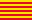

# Marc Muntané 👋

[EN](./README.en.md)  • [ES](./README.md)  • [CA](./README.ca.md) 

I’m a software developer with a Higher National Diploma (Grado Superior) in Web Development (DAW) and Multiplatform Application Development (DAM). I prioritize front‑end and visual design (UX/UI) to craft fast, accessible, and consistent interfaces. I’m comfortable across the stack—from modern front‑end frameworks to back‑end APIs and databases—and I value teamwork and problem‑solving.

---

## Tech stack

## 🚀 Featured projects

| Project | Description | Stack | Link |
|--------|-------------|-------|------|
| **Sustainability** | Interactive web app with environmental challenges | HTML, JS, CSS, UI | [→ Open](https://marcmunta.github.io/Sostenibilidad_v1/) |
| **Social Challenges** | Interactive web app for social and solidarity challenges | HTML, JS, CSS, UI | [→ Open](https://marcmunta.github.io/Retos-Sociales/) |

## 📊 GitHub stats

## 💼 Services

### Frontend & Mobile
- 🎨 **UI/UX Development**: Modern, responsive interfaces
- 📱 **Flutter Apps**: Android, iOS and Web (multi‑platform)
- ⚡ **Web Performance**: Optimization and Core Web Vitals
- 🗺️ **Interactive Maps**: Mapbox and geolocation

### Backend & Full Stack
- 🔧 **REST APIs**: PHP/Laravel and Node.js/TypeScript
- 🗄️ **Databases**: MySQL, design and optimization
- 🔄 **System Integration**: Inter‑platform connectivity
- 🚀 **Deploy & DevOps**: Server setup and CI/CD

## 🎯 Technical specialties

**Frontend:** HTML5, CSS3, JavaScript ES6+, TypeScript, React, Flutter/Dart  
**Backend:** PHP, Laravel, Symfony, Node.js, MySQL, MongoDB, REST APIs  
**Mobile:** Flutter (Android/iOS/Web), Kotlin, Progressive Web Apps  
**Tools:** Git, VS Code, Figma, Mapbox, Firebase

## Contact & links

---

### 🌟 "Building the future, one line of code at a time"

💡 **Always learning** • 🚀 **Shipping solutions** • ⚡ **Optimizing experiences**

