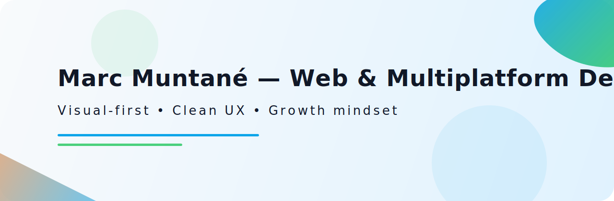
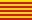

# Marc Muntané Clarà 👋

<picture>
  <source media="(prefers-color-scheme: dark)" srcset="assets/banner-dark.svg" />
  <source media="(prefers-color-scheme: light)" srcset="assets/banner-light.svg" />
  
</picture>

[EN](./README.en.md)  • [ES](./README.md)  • [CA](./README.ca.md) 

Soy programador con título de Grado Superior en Desarrollo de Aplicaciones Web (DAW) y Desarrollo de Aplicaciones Multiplataforma (DAM). Priorizo el front‑end y el diseño visual (UX/UI) para crear interfaces rápidas, accesibles y consistentes. También tengo experiencia full‑stack (APIs y bases de datos) y destaco por el trabajo en equipo y la resolución de problemas.

---

## Stack principal

  

<b>Ver todo el stack (badges)</b>

## 🚀 Proyectos destacados

| Proyecto | Descripción | Stack | Link |
|----------|-------------|-------|------|
| **Sostenibilidad** | App web interactiva de retos medioambientales | HTML, JS, CSS, UI visual | [→ Ver repo](https://marcmunta.github.io/Sostenibilidad_v1/) |
| **Retos Sociales** | App web de retos sociales y solidarios | HTML, JS, CSS, UI | [→ Ver repo](https://marcmunta.github.io/Retos-Sociales/) |

## 📊 GitHub Stats

Si la imagen no se muestra, puede deberse a un fallo temporal del servicio externo. Puedes ver mis repositorios y lenguajes principales directamente en mi <a href="https://github.com/MarcMunta?tab=repositories">perfil de GitHub</a>.

[Ver Top Langs si no se muestra la imagen](https://github-readme-stats.vercel.app/api/top-langs/?username=MarcMunta&theme=tokyonight&hide_border=true&langs_count=8)

## 💼 Servicios especializados

### Frontend & Mobile
- 🎨 **UI/UX Development**: Interfaces modernas y responsive
- 📱 **Apps Flutter**: Android, iOS y Web multiplataforma
- ⚡ **Performance Web**: Optimización y Core Web Vitals
- 🗺️ **Mapas Interactivos**: Integración Mapbox y geolocalización

### Backend & Full Stack
- 🔧 **APIs REST**: PHP/Laravel y Node.js/TypeScript
- 🗄️ **Bases de Datos**: MySQL, diseño y optimización
- 🔄 **Integración de Sistemas**: Conectividad entre plataformas
- 🚀 **Deploy & DevOps**: Configuración de servidores y CI/CD

## 🎯 Especialidades técnicas

**Frontend:** HTML5, CSS3, JavaScript ES6+, TypeScript, React, Flutter/Dart  
**Backend:** PHP, Laravel, Node.js, MySQL, API REST  
**Mobile:** Flutter (Android/iOS/Web), Progressive Web Apps  
**Tools:** Git, VS Code, Figma, Mapbox, Firebase

## Contacto & enlaces

---

### 🌟 "Desarrollando el futuro, una línea de código a la vez"

💡 **Siempre aprendiendo** • 🚀 **Creando soluciones** • ⚡ **Optimizando experiencias**

