<picture>
  <source media="(prefers-color-scheme: dark)" srcset="assets/banner-dark.svg">
  
</picture>

## Stack principal

## Proyectos destacados

<table>
  <tr>
    <td>
      <strong>GameLife</strong> — app web interactiva de hábitos. 
      <em>Stack:</em> JS/TS, UI visual. 
      <a href="https://github.com/MarcMunta/GameLife">→ Ver repo</a>
    </td>
  </tr>
  <tr>
    <td>
      <strong>SpoonApp-Delivery</strong> — app de repartos centrada en logística. 
      <em>Stack:</em> Flutter, mapas. 
      <a href="https://github.com/MarcMunta/SpoonApp-Delivery">→ Ver repo</a>
    </td>
  </tr>
  <tr>
    <td>
      <strong>Mapa</strong> — mapas 2D/3D con Mapbox en web. 
      <em>Stack:</em> Dart/Flutter Web. 
      <a href="https://github.com/MarcMunta/Mapa">→ Ver repo</a>
    </td>
  </tr>
  <tr>
    <td>
      <strong>Social, Portfolio</strong> — componentes UI y landing. 
      <em>Stack:</em> UI visual, web performance. 
      <a href="https://github.com/MarcMunta/Social-Portfolio">→ Ver repo</a>
    </td>
  </tr>
</table>

### 🧭 De idea a crecimiento

```mermaid
flowchart LR
  Idea[Idea] --> Brief[Brief de negocio/cliente]
  Brief --> UX[Wireframes + UX]
  UX --> UI[UI System + Prototipo]
  UI --> Dev[Desarrollo Web/Flutter]
  Dev --> Launch[Lanzamiento]
  Launch --> Measure[Métricas: activación, retención, CAC]
  Measure --> Iterate[Iteración: A/B tests]
  Iterate --> Growth[Growth & Escalado]
```

## Servicios — en qué puedo ayudar

- Landing pages con rendimiento y accesibilidad reales.
- Web apps multiplataforma (PWA / Flutter).
- Dashboards y mapas interactivos con Mapbox.

## Contacto & enlaces

### Últimos posts / ahora escuchando

- Próximamente: artículos y playlists seleccionadas.

Avatar placeholder:

