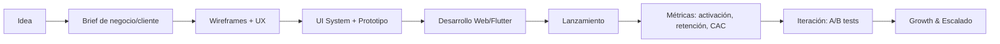

# Marc Muntané 👋

---

## Stack principal

## 🚀 Proyectos destacados

| Proyecto | Descripción | Stack | Link |
|----------|-------------|-------|------|
| **GameLife** | App web interactiva de hábitos y gamificación | JS/TS, UI visual | [→ Ver repo](https://github.com/MarcMunta/GameLife) |
| **Mapa** | Mapas 2D/3D interactivos con Mapbox en web | Flutter Web, Mapbox, Dart | [→ Ver repo](https://github.com/MarcMunta/Mapa) |

### 🧭 De idea a crecimiento

```mermaid
flowchart LR
  Idea[Idea] --> Brief[Brief de negocio/cliente]
  Brief --> UX[Wireframes + UX]
  UX --> UI[UI System + Prototipo]
  UI --> Dev[Desarrollo Web/Flutter]
  Dev --> Launch[Lanzamiento]
  Launch --> Measure[Métricas: activación, retención, CAC]
  Measure --> Iterate[Iteración: A/B tests]
  Iterate --> Growth[Growth & Escalado]
```

## 📊 GitHub Stats

## 💼 Servicios especializados

### Frontend & Mobile
- 🎨 **UI/UX Development**: Interfaces modernas y responsive
- 📱 **Apps Flutter**: Android, iOS y Web multiplataforma
- ⚡ **Performance Web**: Optimización y Core Web Vitals
- 🗺️ **Mapas Interactivos**: Integración Mapbox y geolocalización

### Backend & Full Stack
- 🔧 **APIs REST**: PHP/Laravel y Node.js/TypeScript
- 🗄️ **Bases de Datos**: MySQL, diseño y optimización
- 🔄 **Integración de Sistemas**: Conectividad entre plataformas
- 🚀 **Deploy & DevOps**: Configuración de servidores y CI/CD

## 🎯 Especialidades técnicas

**Frontend:** HTML5, CSS3, JavaScript ES6+, TypeScript, React, Flutter/Dart  
**Backend:** PHP, Laravel, Node.js, MySQL, API REST  
**Mobile:** Flutter (Android/iOS/Web), Progressive Web Apps  
**Tools:** Git, VS Code, Figma, Mapbox, Firebase

## Contacto & enlaces

---

### 🌟 "Desarrollando el futuro, una línea de código a la vez"

💡 **Siempre aprendiendo** • 🚀 **Creando soluciones** • ⚡ **Optimizando experiencias**

⭐️ From [MarcMunta](https://github.com/MarcMunta) with ❤️ • Made in Barcelona 🌆

